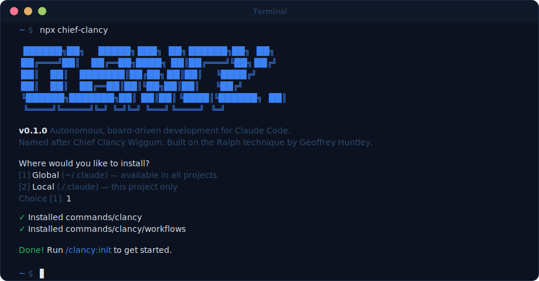

# Clancy

**Autonomous, board-driven development for Claude Code.**

[](https://www.npmjs.com/package/chief-clancy) [](./LICENSE) [](docs/TESTING.md) [](https://github.com/Pushedskydiver/clancy/stargazers)

> [!WARNING]
> Clancy is in early development. Expect bugs, breaking changes, and rough edges. If you hit an issue, please [open a bug report](https://github.com/Pushedskydiver/clancy/issues/new).

```bash
npx chief-clancy
```

Works on Mac, Linux, and Windows.

[What it does](#what-it-does) · [Install](#install) · [Commands](#commands) · [Supported boards](#supported-boards) · [Comparison](./COMPARISON.md) · [Roadmap](./ROADMAP.md) · [Contributing](./CONTRIBUTING.md)

---



Named after Chief Clancy Wiggum (The Simpsons) — built on the [Ralph technique](https://ghuntley.com/ralph/) by Geoffrey Huntley. [See lineage →](#lineage)

---

## What it does

Clancy does six things:

1. **Scaffolds itself** into a project — scripts, docs, CLAUDE.md, .clancy/.env
2. **Scans your codebase** with 5 parallel specialist agents and writes 10 structured docs that Claude reads before every run
3. **Writes strategy briefs** — interviews you (or runs a devil's advocate AI-grill in AFK mode), decomposes work into vertical slices with HITL/AFK classification, and creates board tickets with blocking dependencies
4. **Plans tickets** — fetches backlog tickets, explores the codebase, and generates structured implementation plans posted as comments for human review
5. **Runs autonomously** — picking one ticket per loop from your Kanban board (skipping blocked candidates), implementing it, committing, and creating a PR (targeting an epic branch for parented tickets, or the base branch for standalone tickets)
6. **Verifies before delivery** — runs lint, test, and typecheck via verification gates with self-healing retry, guards against force push and destructive resets, and recovers from crashes via lock file detection

Brief → approve → plan → implement. Pipeline labels (`clancy:brief` → `clancy:plan` → `clancy:build`) move tickets between stages automatically. One ticket per run. Fresh context window every iteration. No context rot.

---

## Who this is for

Clancy is for developers who:

- Use a Kanban board (Jira, GitHub Issues, Linear, Shortcut, Notion, or Azure DevOps) and want Claude to work through their backlog unattended
- Are comfortable with Claude Code and want to extend it for team workflows — not just solo hacking
- Have a codebase with enough structure that an AI agent can make meaningful progress on a ticket without constant hand-holding
- Want to go AFK and come back to committed, merged work

**Clancy is not for you if:**

- You want to supervise every change — use Claude Code directly instead
- Your tickets are large, vague, or span multiple sessions — Clancy works best with small, well-scoped tickets
- You don't use a Kanban board — you can still use `/clancy:map-codebase` for codebase scanning, but the run loop won't apply

Evaluating other tools? See [COMPARISON.md](./COMPARISON.md) for a side-by-side with GSD and PAUL.

---

## Expectations

Clancy is powerful but not magic. Here's what to expect:

**It will get things wrong sometimes.** Claude can misread a ticket, make the wrong architectural choice, or produce code that doesn't compile. This is normal. Use `/clancy:once` to watch the first few runs, then review the output before going fully AFK. Over time you'll learn which ticket types Clancy handles well on your codebase.

**Ticket quality matters more than you think.** A vague ticket produces vague implementation. Clancy works best when tickets have a clear summary, a description that explains the _why_, and concrete acceptance criteria. Use `/clancy:review` to score a ticket before running — it'll tell you exactly what's missing.

**You still own the code.** Clancy pushes a feature branch and creates a pull request for every ticket — targeting an epic branch for parented tickets, or the base branch for standalone ones. When all children of an epic are done, Clancy creates a final PR from the epic branch to your base branch. Either way, treat it like code from a junior developer who works very fast — it needs a sanity check, not a full rewrite.

**Some tickets will need a retry.** If Claude gets stuck or produces something obviously wrong, delete the branch and run `/clancy:once` again. Fresh context, fresh attempt. If it fails twice on the same ticket, the ticket probably needs more detail.

**Clancy is token-heavy.** Each ticket starts a fresh Claude session that reads your codebase docs, CLAUDE.md, and then implements the ticket — before writing a single line of code, it has already consumed significant context. Rough estimates per ticket:

| Ticket complexity | Approximate total tokens | Approximate cost (Sonnet) |
|---|---|---|
| Simple (small change, clear scope) | 50,000–100,000 | $0.25–$0.75 |
| Medium (feature, 5–15 files touched) | 100,000–250,000 | $0.75–$2.00 |
| Complex (large feature, many files) | 250,000–500,000+ | $2.00–$5.00+ |

These are rough estimates — actual usage depends on your codebase doc size, how many files Claude reads during implementation, and how much code it writes. **Check Claude Code's usage dashboard after your first `/clancy:once` run to see real numbers for your codebase.**

A few ways to manage costs:
- Use a lighter model — set `CLANCY_MODEL=claude-haiku-4-5` in `.clancy/.env` for simpler tickets (significantly cheaper, less capable)
- Keep `.clancy/docs/` files concise — they're read in full on every ticket
- Use small, well-scoped tickets — fewer files read, less output generated

---

## Supported boards

- **Jira** — via REST API v3, JQL, ADF description parsing
- **GitHub Issues** — via REST API with PR filtering
- **Linear** — via GraphQL, `viewer.assignedIssues`, `state.type: unstarted`
- **Shortcut** — via REST API v3, workflow state resolution, epic stories
- **Notion** — via REST API, database rows as tickets, property name overrides
- **Azure DevOps** — via REST API, work items, org + project scoping

Community can add boards — see [CONTRIBUTING.md](./CONTRIBUTING.md).

---

## Install

```bash
npx chief-clancy
```

You'll be asked: global install (`~/.claude`) or local (`./.claude`). Either works. Global makes commands available in all projects.

**Prerequisites:**

- [Claude Code](https://claude.ai/code) CLI installed
- Node.js 22+ (`node -v`)
- `git` installed (comes with most development environments)

### Permissions

Clancy is designed to run Claude with `--dangerously-skip-permissions`:

```bash
claude --dangerously-skip-permissions
```

> [!TIP]
> This is how Clancy is intended to be used — stopping to approve `git commit` and `node` 50 times defeats the purpose. Only use it on codebases you own and trust.

---

## Getting started

```bash
# 1. Install Clancy commands
npx chief-clancy

# 2. Open a project in Claude Code, then:
/clancy:init

# 3. Scan your codebase (or say yes during init)
/clancy:map-codebase

# 4. Preview the first ticket (no changes made)
/clancy:dry-run

# 5. Watch your first ticket
/clancy:once

# 6. Go AFK
/clancy:run

# Fully autonomous (no prompts at any step):
# /clancy:brief --afk #42 → /clancy:approve-brief --afk → /clancy:run
```

---

## Commands

| Command                | Description                                                              |
| ---------------------- | ------------------------------------------------------------------------ |
| `/clancy:brief` ²      | Grill phase → strategy brief → vertical slice decomposition → tickets    |
| `/clancy:approve-brief` ² | Review and approve a strategy brief, then create board tickets         |
| `/clancy:plan` ¹       | Refine backlog tickets into structured implementation plans              |
| `/clancy:plan 3` ¹     | Plan up to 3 tickets in batch mode                                       |
| `/clancy:approve-plan` ¹ | Promote an approved plan to the ticket description                     |
| `/clancy:init`         | Wizard — choose board, collect config, scaffold everything               |
| `/clancy:run`          | Loop mode — processes tickets until queue is empty or MAX_ITERATIONS hit |
| `/clancy:run 20`       | Same, override MAX_ITERATIONS to 20 for this session                     |
| `/clancy:once`         | Pick up one ticket and stop                                              |
| `/clancy:dry-run`      | Preview next ticket without making changes — no git ops, no Claude call  |
| `/clancy:status`       | Show next tickets without running — read-only                            |
| `/clancy:review`       | Score next ticket (0–100%) with actionable recommendations               |
| `/clancy:logs`         | Format and display `.clancy/progress.txt`                                |
| `/clancy:map-codebase` | Full 5-agent parallel codebase scan, writes 10 docs                      |
| `/clancy:update-docs`  | Incremental refresh — re-runs agents for changed areas                   |
| `/clancy:settings`     | View and change configuration — model, iterations, board, and more      |
| `/clancy:doctor`       | Diagnose your setup — test every integration, report what's broken       |
| `/clancy:update`       | Update Clancy to latest version                                          |
| `/clancy:uninstall`    | Remove Clancy commands — optionally remove `.clancy/` too               |
| `/clancy:help`         | Command reference                                                        |

¹ Planner is an optional role — see [Roles](#roles) below.
² Strategist is an optional role — see [Roles](#roles) below.

---

## Roles

Clancy organises its commands into **roles** — each role handles a different stage of the development workflow.

| Role | Purpose | Commands |
| --- | --- | --- |
| **Implementer** | Plan → code. Picks up tickets, implements, commits, merges | `/clancy:once`, `/clancy:run`, `/clancy:dry-run` |
| **Reviewer** | Score ticket readiness and track progress | `/clancy:review`, `/clancy:status`, `/clancy:logs` |
| **Setup** | Configure and maintain Clancy | `/clancy:init`, `/clancy:settings`, `/clancy:doctor`, etc. |
| **Planner** *(optional)* | Refine backlog tickets into structured implementation plans | `/clancy:plan`, `/clancy:approve-plan` |
| **Strategist** *(optional)* | Grill → brief → vertical slices → board tickets | `/clancy:brief`, `/clancy:approve-brief` |

**Core roles** (Implementer, Reviewer, Setup) are always installed. **Optional roles** (Planner, Strategist) are opt-in — add them to `CLANCY_ROLES` in `.clancy/.env` and re-run the installer:

```bash
# Enable optional roles
echo 'CLANCY_ROLES="planner,strategist"' >> .clancy/.env
npx chief-clancy@latest --local   # or --global
```

You can also toggle roles from within Claude Code using `/clancy:settings`.

Each role has detailed documentation:

- [Implementer](docs/roles/IMPLEMENTER.md) — picks up tickets, implements, commits, merges (AFK loop support)
- [Reviewer](docs/roles/REVIEWER.md) — scores ticket readiness, tracks progress
- [Setup & Maintenance](docs/roles/SETUP.md) — init wizard, settings, diagnostics, codebase mapping
- [Planner](docs/roles/PLANNER.md) — refines backlog tickets into structured implementation plans
- [Strategist](docs/roles/STRATEGIST.md) — grill phase, strategy briefs, vertical slice decomposition, board ticket creation

For a visual overview of how roles, commands, and flows connect, see the [Visual Architecture](docs/VISUAL-ARCHITECTURE.md) diagrams.

---

## What gets created

```
.clancy/
  clancy-once.js      — picks up one ticket, implements, commits, merges
  clancy-afk.js       — loop runner (board-agnostic)
  docs/               — 10 structured docs read before every run
    STACK.md
    INTEGRATIONS.md
    ARCHITECTURE.md
    CONVENTIONS.md
    TESTING.md
    GIT.md
    DESIGN-SYSTEM.md
    ACCESSIBILITY.md
    DEFINITION-OF-DONE.md
    CONCERNS.md
  progress.txt        — append-only log of completed tickets
  .env                — your board credentials (gitignored)
  .env.example        — credential template for your board
```

Clancy also merges a section into your `CLAUDE.md` (or creates one) that tells Claude to read all these docs before every run.

---

## Configuration

Clancy supports optional enhancements — Figma design specs, Playwright visual checks, status transitions, and Slack/Teams notifications. All are configured via `.clancy/.env` or `/clancy:settings`.

See [Configuration guide](docs/guides/CONFIGURATION.md) for full details and all environment variables.

---

## Lineage


Clancy is built on the **Ralph technique** coined by **Geoffrey Huntley** ([ghuntley.com/ralph/](https://ghuntley.com/ralph/)).

Ralph in its purest form:

```bash
while :; do cat PROMPT.md | claude-code; done
```

Clancy is what happens when you take that idea seriously for team development. See [CREDITS.md](./CREDITS.md) for the full story.

---

## Security

Clancy runs Claude with `--dangerously-skip-permissions` for unattended operation. It includes a credential guard hook, recommended permission deny lists, and token scope guidance.

See [Security guide](docs/guides/SECURITY.md) for full details — permissions model, credential protection, token scopes, and webhook security.

---

## Troubleshooting

**Start here:** run `/clancy:doctor` — it tests every integration and tells you exactly what's broken and how to fix it.

See [Troubleshooting guide](docs/guides/TROUBLESHOOTING.md) for common issues and solutions.

---

## Contributing

See [CONTRIBUTING.md](./CONTRIBUTING.md). The most useful contribution is adding a new board — it's a TypeScript module + a JSON entry.

## License

MIT — see [LICENSE](./LICENSE).
