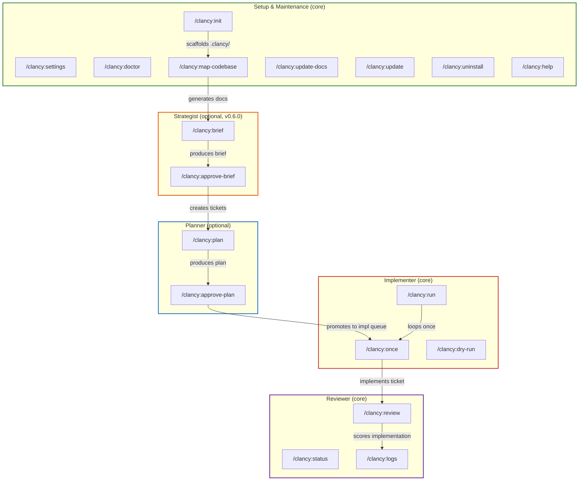
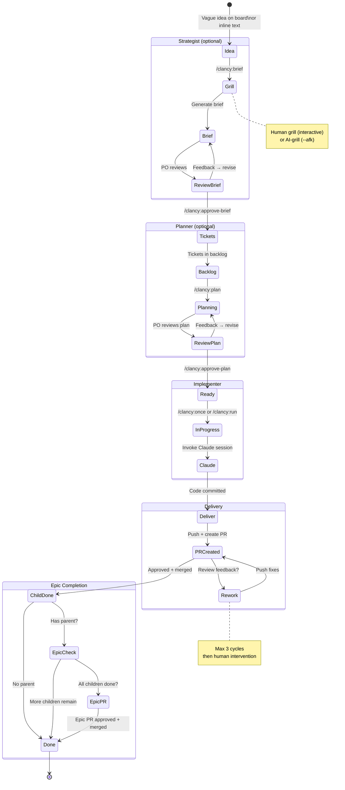
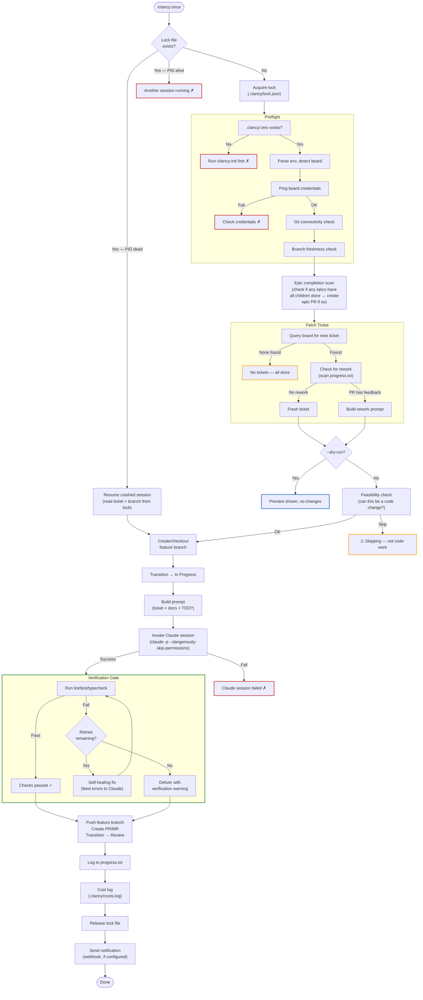
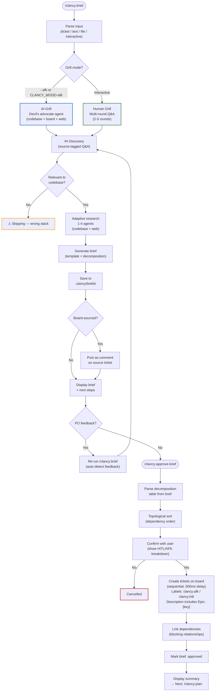
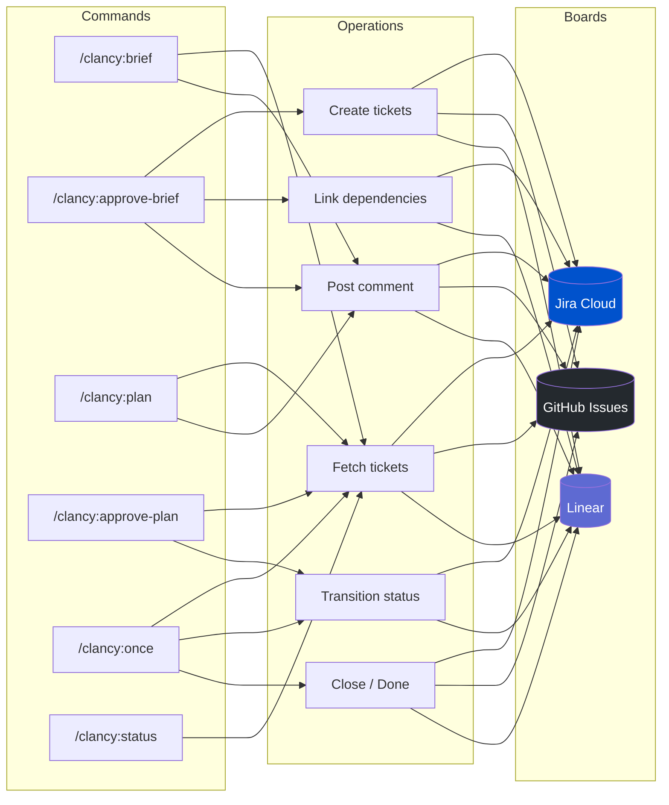
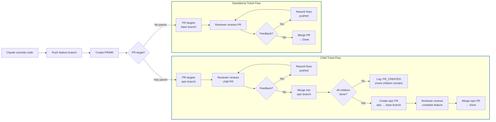

# Clancy — Visual Architecture

Interactive diagrams showing how roles, commands, and flows connect. Rendered natively by GitHub.

## Table of Contents

1. [Role & Command Map](#1-role--command-map) — all 5 roles and their 17 commands
2. [Ticket Lifecycle](#2-ticket-lifecycle--end-to-end) — state machine from idea to merged code
3. [Once Orchestrator](#3-the-once-orchestrator--implementation-flow) — what happens inside `/clancy:once`
4. [Strategist Flow](#4-strategist-flow--brief-to-tickets-v060) — `/clancy:brief` and `/clancy:approve-brief`
5. [Board API Matrix](#5-board-api-interaction-matrix) — which commands talk to which APIs
6. [File Artifacts](#6-file-artifacts--what-lives-in-clancy) — everything in `.clancy/`
7. [Delivery Paths](#7-delivery-paths--pr-flow-with-epic-branches) — PR flow with epic branches
8. [Prompt Building](#8-prompt-building--what-claude-receives) — what Claude gets for implementation and rework

---

## 1. Role & Command Map

Every command organised by role. Core roles are always installed; optional roles opt-in via `CLANCY_ROLES`.

---

## 2. Ticket Lifecycle — End to End

A ticket's complete journey from vague idea to merged code. The strategist and planner are optional — tickets can enter the implementer queue directly.

---

## 3. The Once Orchestrator — Implementation Flow

What happens inside `/clancy:once` (and each iteration of `/clancy:run`).

---

## 4. Strategist Flow — Brief to Tickets (v0.6.0)

The strategist's two commands: `/clancy:brief` (idea → brief) and `/clancy:approve-brief` (brief → board tickets).

---

## 5. Board API Interaction Matrix

Which commands talk to which board APIs, and what operations they perform.

---

## 6. File Artifacts — What Lives in `.clancy/`

Everything Clancy creates and reads in the user's project.

```mermaid
graph TD
    subgraph ".clancy/"
        env[".env\n(board credentials + config)"]
        oncejs["clancy-once.js\n(esbuild bundle)"]
        afkjs["clancy-afk.js\n(esbuild bundle)"]
        pkg["package.json\n({'type':'module'})"]
        progress["progress.txt\n(run log)"]
        costslog["costs.log\n(token cost estimates)"]
        lockfile["lock.json\n(crash recovery)"]
        sessionrpt["session-report.md\n(AFK summary)"]
        claudemd["CLAUDE.md\n(project instructions)"]

        subgraph "docs/"
            stack["STACK.md"]
            arch["ARCHITECTURE.md"]
            conv["CONVENTIONS.md"]
            test["TESTING.md"]
            dod["DEFINITION-OF-DONE.md"]
            design["DESIGN-SYSTEM.md"]
            a11y["ACCESSIBILITY.md"]
        end

        subgraph "briefs/ (v0.6.0)"
            brief1["2026-03-18-dark-mode.md"]
            brief1a[".approved marker"]
            brief2["2026-03-17-auth-rework.md"]
            feedback["...feedback.md\n(companion file)"]
        end
    end

    init(["/clancy:init"]) -->|creates| env
    init -->|copies| oncejs
    init -->|copies| afkjs
    init -->|writes| pkg

    mapcb(["/clancy:map-codebase"]) -->|generates| stack
    mapcb -->|generates| arch
    mapcb -->|generates| conv
    mapcb -->|generates| test

    brief(["/clancy:brief"]) -->|writes| brief1
    approvebrief(["/clancy:approve-brief"]) -->|writes| brief1a

    once(["/clancy:once"]) -->|reads| env
    once -->|reads| stack
    once -->|appends| progress
    once -->|executes| oncejs

    logs(["/clancy:logs"]) -->|reads| progress

    style env stroke:#e65100,stroke-width:2px
    style progress stroke:#2e7d32,stroke-width:2px
    style oncejs stroke:#c62828,stroke-width:2px
    style afkjs stroke:#c62828,stroke-width:2px
```

---

## 7. Delivery Paths — PR Flow with Epic Branches

All tickets are delivered via PR. The target branch depends on whether the ticket has a parent.

---

## 8. Prompt Building — What Claude Receives

The complete prompt structure for implementation and rework.

```mermaid
graph TD
    subgraph "Implementation Prompt"
        Header["You are implementing {ticket}"]
        Context["Ticket: key, title, description\nEpic/Parent | Blockers"]
        Exec["Step 0: Executability check\n(skip if not code work)"]
        TDD{"CLANCY_TDD\nenabled?"}
        TDD -->|Yes| TDDBlock["## TDD\nRed-green-refactor cycle"]
        TDD -->|No| Steps
        TDDBlock --> Steps
        Steps["1. Read .clancy/docs/\n2. Follow GIT.md\n3. Implement fully\n4. Commit\n5. Confirm done"]
    end

    subgraph "Rework Prompt"
        RHeader["You are fixing feedback on {ticket}"]
        RContext["Description + previous diff"]
        RFeedback["## Reviewer Feedback\n1. Issue A\n2. Issue B"]
        RTDD{"CLANCY_TDD?"}
        RTDD -->|Yes| RTDDBlock["## TDD"]
        RTDD -->|No| RSteps
        RTDDBlock --> RSteps
        RSteps["1. Read docs\n2. Follow GIT.md\n3. Fix feedback only\n4. Commit\n5. Confirm done"]
    end

    Header --> Context --> Exec --> TDD
    RHeader --> RContext --> RFeedback --> RTDD

    style TDDBlock stroke:#1565c0,stroke-width:2px
    style RTDDBlock stroke:#1565c0,stroke-width:2px
```

