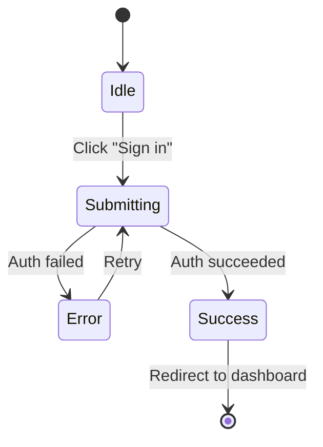

# Design-Aware Implementation (v0.9.0) — Design Document

**Status:** DA reviewed — awaiting user approval
**Date:** 2026-03-20

---

## Problem

Clancy implements tickets with no awareness of UI design. When a ticket involves building a component, page, or form, Clancy produces code that is functionally correct but has no design intent: no accessibility attributes, no keyboard navigation, no content specifications for error states or empty states, and no spatial layout guidance. The reviewer catches these gaps manually, triggering rework cycles that could have been avoided if design context existed before implementation began.

Three specific failure modes:

1. **No design specifications.** The planner produces technical approach and file lists, but nothing about component props, ARIA roles, keyboard maps, or content strings. Clancy implements a form with placeholder text like "Enter value" instead of the actual copy.
2. **No visual verification.** After implementation, nobody checks whether the rendered output matches the intent. Screenshots are not taken, accessibility is not scanned, performance is not measured. The PR is a diff — the reviewer must run the app locally to evaluate the UI.
3. **No design feedback loop.** Teams using design tools (Figma, Stitch) have no way to connect design previews to the Clancy workflow. Design feedback arrives on the board as comments, but Clancy does not distinguish design feedback from technical feedback when revising a plan.

v0.9.0 addresses the first: extend the planner with conditional design specifications. v0.9.1 follows with Stitch integration and visual verification.

---

## Release Strategy

**Ship in two increments:**

- **v0.9.0** — Wave 1 only (design sub-phase in planner). Zero external dependencies, immediate value, zero risk to existing flows.
- **v0.9.1** — Waves 2-3 (Stitch integration + visual verification). External tool dependencies (Stitch MCP, Playwright, axe-core, Lighthouse) isolated from the core feature.

This avoids Stitch/Playwright issues blocking the highest-value feature (design specs in plans).

---

## Design Sub-Phase in Planner

### UI Ticket Detection

The planner activates design instructions conditionally. When the ticket title or description contains UI-related terms, the planner produces a `## Design Specifications` section in the plan.

**Detection heuristic:** ticket mentions UI, component, page, form, modal, dialog, sidebar, dashboard, navigation, button, input, table, or similar keywords in title or description. This is a natural language check (Claude reads the ticket and decides), not rigid keyword matching — the terms listed are examples of the signal, not an exhaustive list.

**Non-UI tickets:** skip the design section entirely. A ticket like "Migrate database schema" or "Add rate limiting to API" gets a standard plan with no design specs. This avoids adding token cost to tickets that do not benefit from design context.

### Design Specification Sections

When activated, the planner produces these sections inside `## Design Specifications`:

**Component Specifications** — props, variants, states as TypeScript-like interface sketches. Example:

```typescript
interface LoginFormProps {
  onSubmit: (credentials: { email: string; password: string }) => void;
  isLoading: boolean;
  error?: string;
  providers?: ('google' | 'github')[];
}

// States: idle, submitting, error, success
// Variants: default (email/password), social (with OAuth buttons)
```

**Accessibility Specifications** — targeting **WCAG 2.2 AA** conformance. ARIA roles/attributes, keyboard navigation maps, focus management rules, screen reader announcements. References the [ARIA Authoring Practices Guide (APG)](https://www.w3.org/WAI/ARIA/apg/) for canonical widget patterns.

The planner must address these for every UI component:

1. **Name, Role, Value (4.1.2)** — every interactive element has an accessible name and correct role. Prefer native HTML (`<button>`, `<nav>`, `<dialog>`) over ARIA where possible (first rule of ARIA).
2. **Keyboard (2.1.1)** — all functionality keyboard-operable. Custom elements need `tabindex`, `onKeyDown` for Enter/Space. No keyboard traps (2.1.2).
3. **Focus Order (2.4.3)** — DOM order matches visual order. Focus returned to trigger element after modal/dialog close.
4. **Focus Visible (2.4.7)** + **Focus Not Obscured (2.4.11, new in 2.2)** — visible focus indicator, not hidden by sticky headers or overlays.
5. **Target Size (2.5.8, new in 2.2)** — interactive targets at least 24x24 CSS pixels.
6. **Status Messages (4.1.3)** — live regions for toasts, validation summaries, loading states.
7. **Error Association** — form errors linked via `aria-describedby`, not just visual proximity.
8. **Reduced Motion** — `prefers-reduced-motion` media query for animations/transitions.

Example specification table:

| Element | Role | ARIA | Keyboard | Announcement |
|---|---|---|---|---|
| Login form | `form` | `aria-label="Sign in"` | — | — |
| Email input | `textbox` | `aria-required="true"`, `aria-invalid` on error, `aria-describedby` for error | Tab to focus | "Email address, required" |
| Submit button | `button` | `aria-busy` when loading | Enter to submit, Tab to reach | "Sign in" / "Signing in..." |
| Error alert | `alert` | `aria-live="assertive"` | — | Announces error text on appear |

**Content Specifications** — error messages, empty states, loading states, form labels, help text, toast messages. Example:

| Context | Content |
|---|---|
| Email empty | "Email address is required" |
| Email invalid | "Enter a valid email address" |
| Password too short | "Password must be at least 8 characters" |
| Auth failed | "Invalid email or password. Please try again." |
| Loading state | "Signing in..." |
| Success toast | "Welcome back, {name}" |

**User Flow Diagrams** — Mermaid state diagrams for multi-step interactions:



**Layout Descriptions** — text descriptions of spatial arrangement (not wireframes). Example: "The login form is centered vertically and horizontally. Email and password inputs are stacked vertically with 16px gap. The submit button spans the full width below the inputs. OAuth buttons appear below a 'or continue with' divider. Error messages appear above the form as an alert banner."

**Pages** — explicit route/URL mapping for visual verification. Links component names to actual pages. Example:

| Component | Route | URL |
|---|---|---|
| LoginForm | `/login` | `http://localhost:3000/login` |
| LoginForm (Storybook) | — | `http://localhost:6006/?path=/story/loginform` |

If the project uses Storybook, prefer story URLs. If dev server only, use route URLs. This section is **optional** in design specs — the planner includes it when route info is available, omits it otherwise. For visual verification (Wave 3), URL resolution uses a 3-tier fallback: (1) `CLANCY_DEV_URLS` env var (explicit, highest priority), (2) `### Pages` from design specs, (3) Storybook auto-detection. If all three yield no URLs, visual verification is skipped with a PR comment: "Visual verification skipped — no page URLs available."

### Why These Six Sections

Accessibility specifications are the highest-value design artifact — they directly become ARIA attributes and keyboard handlers in the implementation. Content specifications eliminate placeholder text. Component specifications give the implementer a type contract before writing code. User flow diagrams catch missing states (what happens on error? on timeout? on back-navigation?). Layout descriptions provide spatial intent without attempting ASCII wireframes. Pages maps components to URLs for visual verification — optional in the spec but critical for Playwright/axe-core/Lighthouse to know which pages to check.

No wireframes or visual mockups in text form — text cannot reliably convey pixel-level layout, and the attempt produces artifacts that are neither useful to humans nor parseable by code. Text layout descriptions communicate spatial relationships ("stacked vertically", "centered", "full width") that map to CSS patterns.

---

## Google Stitch Integration

### Overview

After the plan is generated (inside `/clancy:plan`, before approval), if `CLANCY_STITCH=true`, Clancy generates a visual design preview from the design specifications using Google Stitch. The preview is posted as a board comment with an embedded screenshot and a link to the interactive prototype.

Stitch is optional. Teams without Stitch continue as before — the design specifications in the plan are the design artifact, and implementation proceeds from those specs alone.

### Stitch Context — Codebase-Aware Prompting

The Stitch prompt is not a bare description. The planner has already explored the codebase, read `.clancy/docs/`, and produced design specifications. Stitch receives the full context:
- **Existing design system** — component library, design tokens, CSS framework (from codebase exploration)
- **Component specifications** — props, variants, states (from design specs)
- **Content specifications** — actual copy, error messages, labels (from design specs)
- **Accessibility requirements** — ARIA patterns, keyboard navigation (from design specs)
- **Layout descriptions** — spatial arrangement (from design specs)

This produces high-fidelity Stitch output that matches the project's visual language and component patterns, not generic designs.

### Generation Flow

```
/clancy:plan generates plan with ## Design Specifications
       |
       v
  CLANCY_STITCH=true AND plan has design specs?
       |
  +----+----+
  No        Yes
  |         |
  v         v
Done      Generate Stitch screens via MCP tool call:
(plan       - Component specs → screen layout
posted      - Content specs → actual text
only)       - A11y specs → ARIA annotations
            - Layout descriptions → spatial arrangement
            - Codebase context → design system, tokens, patterns
              |
              v
          Post board comment (after plan comment):
            ## Clancy Design Preview
            [Screenshot inline or link]
            [Link to interactive Stitch prototype]
            "Review this design and leave feedback
             on this ticket. Run /clancy:plan to
             revise based on your feedback."
              |
              v
          Wait for /clancy:plan (human triggers re-plan + re-generate)
          or proceed to /clancy:approve-plan (human approves both)
          or auto-approve (AFK mode — no feedback loop)
```

**Trigger point:** Stitch generation happens inside the `/clancy:plan` workflow, after the plan is generated and posted. NOT during `/clancy:approve-plan` — the preview should exist before the human approves the plan, so they can review plan + design together.

### Board Comment Format

The design preview is posted as a ticket comment with the marker heading `## Clancy Design Preview`. This marker is used to detect existing design previews and replace them on revision (same pattern as the existing `## Clancy Plan` and `## Clancy Brief` comments).

**Screenshot persistence:** Stitch returns download URLs that may be temporary. To ensure screenshots remain visible in board comments:
- **GitHub:** Upload the screenshot via the repo's content API or use the Stitch project URL (persistent) as a link
- **Jira:** Upload as an attachment via `POST /rest/api/3/issue/{key}/attachments`, then reference in the ADF comment
- **Linear:** Linear supports markdown image URLs — use the Stitch project screenshot URL directly
- **Shortcut:** Post as a markdown comment with the Stitch project URL (Shortcut supports markdown image syntax)
- **Notion:** Post as a page comment with the screenshot URL (Notion API `POST /v1/comments`)
- **Azure DevOps:** Post as a work item comment with the screenshot URL (Azure DevOps supports markdown in comments)
- **Fallback (all boards):** If upload/posting fails, post the Stitch project link without an inline screenshot. The reviewer can click through to see the design.

### Feedback Loop

When `/clancy:plan` is run after a design preview has been posted:

1. Clancy detects post-design-preview comments on the ticket (comments with timestamps after the most recent `## Clancy Design Preview` comment)
2. Each comment is classified into one of three paths:

```
Comment classified
       |
  +----+----+
  |         |
  Tech      Everything
  only      else
  |         |
  v         v
Revise    Revise specs
plan      + regenerate
specs     Stitch (if enabled)
only
```

3. **Technical-only feedback** → revise `## Technical Approach` in the plan only. Do NOT regenerate Stitch. Examples: "use server components instead", "this should be a REST endpoint not GraphQL", "add pagination".
4. **Design/visual/general feedback** → revise `## Design Specifications` AND regenerate Stitch (if enabled). This covers pure visual changes ("make the sidebar wider"), functional design changes ("add a close button"), and mixed/unclear feedback. Examples: "change the primary colour", "add a loading spinner", "the layout is wrong AND the API needs changing".

The 2-path system is deliberately simple: technical-only feedback is the only case where Stitch regeneration is skipped. Everything else revises specs + regenerates. This avoids the complexity of distinguishing "visual only" from "spec-affecting" (a nuanced judgment that adds classification risk for marginal token savings).

### Smart Feedback Classification

Classification uses natural language understanding — Claude reads the comment and decides which path it belongs to. Not keyword matching.

**The key distinction: is this ONLY about the technical approach, or does it touch design/visual/content at all?**

| Feedback | Path | Action |
|---|---|---|
| "Use server components" | Technical only | Revise plan, no Stitch |
| "Add rate limiting" | Technical only | Revise plan, no Stitch |
| "Make the sidebar wider" | Design | Revise specs + regenerate Stitch |
| "Change the primary colour" | Design | Revise specs + regenerate Stitch |
| "Add a close button" | Design | Revise specs + regenerate Stitch |
| "The form needs validation" | Design | Revise specs + regenerate Stitch |
| "Wrong layout AND wrong API" | Both | Revise both + regenerate Stitch |
| Unclear / mixed | Fallback | Revise both + regenerate Stitch |

If in doubt, treat as design feedback. The cost of an unnecessary Stitch regeneration (~1 generation out of 350/month) is lower than the cost of missing a design change.

### AFK Mode Behaviour

In AFK mode (`CLANCY_MODE=afk`), Stitch generates once and is auto-approved. No feedback loop — implementation proceeds immediately with the design specs and Stitch reference. This avoids blocking autonomous runs on human design review.

### Relationship to Figma MCP

Stitch is additive, not a replacement. Teams with existing Figma workflows keep Figma MCP. Both are optional, neither is required.

**When both are configured:** Figma is the source of truth for existing designs. Stitch generates previews for new work. The implementer references both — Figma for brand consistency, Stitch for the specific ticket's design.

### Init Workflow — Design Tools

The design tool question appears during `/clancy:init` **only when Planner or Strategist is enabled** (no optional roles = no design tool question). The design sub-phase in the planner produces text specs regardless of the tool choice — the tool selection only controls whether visual previews are generated.

```
Step 4g: Design Tools (gated on Planner OR Strategist enabled)

  ━━━━━━━━━━━━━━━━━━━━━━━━━━━━━━━━━━━━━━━
  Design Tools
  ━━━━━━━━━━━━━━━━━━━━━━━━━━━━━━━━━━━━━━━

  When planning UI tickets, Clancy generates design specifications
  (component specs, accessibility, content) in the implementation plan.

  Optionally connect a design tool for visual previews:

    [1] None — text specs only (recommended to start)
    [2] Figma MCP — read existing designs from Figma
    [3] Google Stitch — generate design previews from specs
    [4] Both — Figma for existing designs, Stitch for new work

  Select [1-4]: _
```

**If [2] Figma MCP selected:**
```
  Figma MCP is configured through Claude Code's MCP settings.
  See: https://docs.figma.com/mcp

  No Clancy env vars needed — Figma MCP is managed by Claude Code.
```

**If [3] or [4] Google Stitch selected:**
```
  Stitch API key (from stitch.withgoogle.com/settings): ___
```

Writes to `.clancy/.env`:
```
CLANCY_STITCH=true
STITCH_API_KEY=xxx
```

Configures Claude Code MCP server (writes to `.claude/settings.json`):
```json
{
  "mcpServers": {
    "stitch": {
      "command": "npx",
      "args": ["@_davideast/stitch-mcp", "proxy"],
      "env": { "STITCH_API_KEY": "xxx" }
    }
  }
}
```

**If [1] None selected:** No env vars, no MCP config. The planner still produces design specs in text — they just don't get a visual preview.

### Settings Workflow

`/clancy:settings` gains a Design Tools section:
```
  [D1] Design tool    (None / Figma / Stitch / Both)
  [D2] Stitch API key
```

`[D1]` toggles `CLANCY_STITCH` and manages the MCP server config. `[D2]` only appears when Stitch is enabled.

### Stitch Integration Approach — MCP, Not SDK

**The Stitch SDK (`@google/stitch-sdk`) is an MCP client internally.** It depends on `@modelcontextprotocol/sdk` and `zod@4`, which conflicts with Clancy's `zod/mini` and breaks esbuild bundling (MCP transport uses dynamic imports). The SDK cannot be used as a simple npm dependency.

**Instead, use Stitch via Claude Code's native MCP support.** Configure the Stitch MCP server in Claude Code's settings. When the planner needs to generate a design preview, it invokes Stitch tools through the MCP protocol — Claude Code handles the connection lifecycle. This means:
- No npm dependency on `@google/stitch-sdk`
- No zod version conflict
- No esbuild bundling issues
- Claude Code's full conversation context (codebase knowledge, design specs) is available to the Stitch tool call
- The community MCP proxy (`@_davideast/stitch-mcp`) provides Claude Code configuration out of the box

**MCP tool names (from `@_davideast/stitch-mcp`):**
- `build_site` — generate screens from a text prompt. Returns project URL + screen URLs.
- `get_screen_code` — get HTML/CSS code for a generated screen.
- `get_screen_image` — get screenshot URL for a generated screen.

The planner workflow instructs Claude to call `build_site` with the design specs as the prompt, then `get_screen_image` to get the screenshot URL for the board comment.

**MCP configuration (added by `/clancy:init`):**
```json
{
  "mcpServers": {
    "stitch": {
      "command": "npx",
      "args": ["@_davideast/stitch-mcp", "proxy"],
      "env": { "STITCH_API_KEY": "{from .clancy/.env}" }
    }
  }
}
```

**Rate limits:** Stitch allows 350 generations per month (~11/day). Heavy autonomous use could exhaust this quickly — a single AFK night with 20 UI tickets could use 20+ generations. Mitigation:
- Track generation count in `.clancy/stitch-usage.json` — the planner prompt instructs Claude to read this file before generating, increment the count, and write it back. Simple JSON: `{ "month": "2026-03", "count": 42 }`. No TypeScript module needed — Claude reads/writes the file directly.
- Warn at 50% (175 generations) — display a warning in the plan output
- Skip generation at 100% with a note in the plan comment
- Count resets when the month changes (Claude checks `month` field against current month)

**Stitch unavailability:** If Stitch API is down, rate limited, or Google discontinues it, the workflow degrades gracefully — design specs remain in the plan, no preview is generated, a warning is posted. The design sub-phase (Wave 1) works entirely without Stitch.

---

## Verification Extensions

### Playwright CLI Visual Verification

After UI ticket implementation, before PR creation (in the verification gate phase):

1. **Dev server detection.** Read `package.json` scripts for common dev server commands (`dev`, `start`, `serve`, `storybook`). If found, launch the server and wait for it to be ready (poll the port).
2. **Screenshot capture.** Use Playwright CLI (`npx playwright screenshot`) to capture affected pages. Page URLs are inferred from the ticket's design specs (component names map to routes/stories).
3. **Visual comparison:**
   - **If Stitch design exists:** Compare Playwright screenshots against Stitch output. Use structural comparison (element counts, layout flow, text content) not pixel-level diffing. Pixel comparison is fragile — different fonts, rendering engines, and viewport sizes produce false positives.
   - **If no Stitch design:** Compare against design spec descriptions. Check that specified components exist, content matches content specs, and ARIA attributes are present in the rendered HTML.
4. **Report results in PR body.** Include screenshots and any discrepancies in a `## Visual Verification` section.

**Skip conditions:** If no dev server script is found, skip visual verification. Warn in the PR body: "Visual verification skipped — no dev server detected."

### axe-core CLI Accessibility Verification

After UI ticket implementation, in the verification gate:

1. **Run axe-core.** Use `npx axe` against affected pages (same dev server as Playwright).
2. **Check against specs.** Compare axe-core results against the accessibility specifications from the design sub-phase. Flag violations that contradict specified ARIA roles/attributes.
3. **Report in PR body.** Include WCAG violations in a `## Accessibility Verification` section.
4. **Flag critical violations.** A-level WCAG violations (Level A — minimum conformance) are flagged as "needs attention" in the PR body. If the violation is auto-fixable (e.g. missing `aria-label`), a follow-up commit is pushed to the PR branch as a **separate commit** (not amend) using format `fix(a11y): <description>`. This triggers CI (expected, validates the fix). Rework detection does NOT pick it up — rework requires `changesRequested` review state from a human reviewer. The verification gate (Stop hook) does NOT re-fire — it only runs during the Claude Code session, which has ended by phase 10a. AA/AAA violations are reported as warnings only. Note: visual checks are post-delivery (non-blocking) — they do NOT block PR creation like the Stop hook does for lint/test/typecheck.

### Lighthouse CI

After UI ticket implementation:

1. **Run Lighthouse.** Use `npx lighthouse` on affected pages.
2. **Report scores in PR body.** Performance, accessibility, SEO, best practices scores in a `## Lighthouse Scores` section.
3. **Configurable threshold.** `CLANCY_LIGHTHOUSE_THRESHOLD` sets the minimum score (default: 0 = disabled). When set above 0, scores below the threshold produce a warning in the PR body.

### Verification Gate Integration

### Two-Phase Verification

Visual checks are fundamentally different from code checks (lint/test/typecheck): they're slow (10-30s each), non-deterministic (rendering varies), and most findings aren't auto-fixable (Lighthouse scores, visual regressions). They run as a **new phase 10a (visual-verify) in the once orchestrator**, between deliver (phase 10) and cost (phase 11). This phase only activates for UI tickets (detected from the plan's `## Design Specifications` section presence). Not in the Stop hook.

**Phase 1: Stop hook (existing, fast, blocking)**
```
Stop event fires → lint, test, typecheck
  Pass → allow delivery (create PR)
  Fail → self-healing retry → re-check
```

**Phase 2: Post-delivery visual checks (new, slow, non-blocking)**
```
PR created → is this a UI ticket?
  No → skip
  Yes → check elapsed time against CLANCY_TIME_LIMIT:
    >= 100% → skip entirely ("Visual verification skipped — time limit exceeded")
    >= 80%  → run checks but skip auto-fix commits (report only)
    < 80%   → run everything including auto-fixes
  → launch dev server → run Playwright + axe-core + Lighthouse
    → Post results as PR comment (## Visual Verification section)
    → A-level WCAG violations flagged as "needs attention" in PR body
    → Lighthouse below threshold flagged as warning
    → Screenshots attached to PR
```

This separation means:
- Code checks remain fast and blocking (same as v0.7.0)
- Visual checks run after the PR exists, don't block delivery, don't hit the time guard
- The reviewer sees visual results alongside the code diff
- Self-healing retry applies to code checks (fixable) but NOT visual checks (most aren't auto-fixable — Lighthouse scores, layout regressions)
- axe-core A-level violations (e.g. missing `aria-label`) CAN trigger a follow-up commit to the PR branch if auto-fixable

---

## Env Vars

| Variable | Default | Description |
|---|---|---|
| `CLANCY_STITCH` | `false` | Enable Google Stitch design preview generation. Requires `STITCH_API_KEY`. |
| `STITCH_API_KEY` | — | Google Stitch API key. Required when `CLANCY_STITCH=true`. |
| `CLANCY_LIGHTHOUSE_THRESHOLD` | `0` | Minimum Lighthouse score before warning. Range: 0–100. `0` = disabled (default). |
| `CLANCY_DEV_URLS` | — | Manual URL mapping for visual verification. Format: `LoginForm=http://localhost:3000/login,Dashboard=http://localhost:3000/`. Falls back to `### Pages` in design specs or Storybook auto-detection. |

All env vars are defined in `.clancy/.env` and validated by the Zod schema in `src/schemas/env.ts`.

---

## File System Artifacts

### New Files

| Path | Purpose | Format | Created by | Lifetime |
|---|---|---|---|---|
| `.clancy/stitch-usage.json` | Stitch generation count tracking | JSON: `{ "month": "2026-03", "count": 42 }` | Claude (via planner prompt instructions) | Reset when month changes |

### Modified Files

| Path | Change |
|---|---|
| `src/roles/planner/workflows/plan.md` | Add conditional design instructions, `## Design Specifications` template (6 sections incl. Pages), UI ticket detection, smart feedback classification, Stitch MCP invocation, usage tracking |
| `src/roles/setup/workflows/init.md` | Add design tool prompt (None / Figma MCP / Google Stitch / Both) |
| `src/schemas/env.ts` | Add `CLANCY_STITCH`, `STITCH_API_KEY`, `CLANCY_LIGHTHOUSE_THRESHOLD`, `CLANCY_DEV_URLS` |
| `src/scripts/once/phases/visual-verify.ts` | NEW: post-delivery visual verification phase (Playwright + axe-core + Lighthouse). Runs after deliver phase, before cost phase. Dev server lifecycle managed here. |
| `src/scripts/shared/pull-request/pr-body/pr-body.ts` | Add `## Visual Verification`, `## Accessibility Verification`, `## Lighthouse Scores` sections (all 6 boards) |

---

## Execution Plan

Three waves with devil's advocate review gates. Each wave is a branch + PR. Shipped in two releases: **v0.9.0** (Wave 1) and **v0.9.1** (Waves 2-3).

### Wave 1 — Design Sub-Phase (v0.9.0)

**Scope:** Extend planner workflow with design instructions. Add conditional `## Design Specifications` template. Implement UI ticket detection. Add smart feedback classification for post-design comments.

**Files:**
- `src/roles/planner/workflows/plan.md` — conditional design instructions, specification template, feedback classification guidance
- `src/roles/planner/workflows/plan.md` test scenarios — verify design specs appear for UI tickets, verify skipped for non-UI tickets, verify feedback classification

**Review gate:** Does the design section activate correctly for UI tickets? Does it stay silent for non-UI tickets? Does smart feedback classification handle ambiguous comments via the "general" fallback? Is the accessibility specification format directly translatable to ARIA attributes?

### Wave 2 — Stitch Integration (v0.9.1)

**Scope:** SDK setup, Stitch generation from design specs, board comment posting (screenshot + link), feedback loop integration, init wizard update, usage tracking.

**Files:**
- `src/roles/planner/workflows/plan.md` — add Stitch MCP tool invocation after plan generation (conditional on `CLANCY_STITCH=true`). Includes inline instructions for: reading `.clancy/stitch-usage.json`, checking generation count, calling `build_site` + `get_screen_image` MCP tools, posting board comment with screenshot, incrementing usage count. All Stitch logic lives in the markdown prompt — no separate TypeScript modules needed (the planner is a markdown workflow, not TypeScript).
- `src/roles/setup/workflows/init.md` — design tool prompt + MCP server configuration
- `src/schemas/env.ts` — `CLANCY_STITCH`, `STITCH_API_KEY`

**New env vars:** `CLANCY_STITCH`, `STITCH_API_KEY`

**MCP config:** `/clancy:init` adds Stitch MCP server to Claude Code's settings when `CLANCY_STITCH=true`

**Review gate:** Does the SDK wrapper handle auth failures and rate limits gracefully? Does the board comment use the `## Clancy Design Preview` marker consistently? Does the feedback loop correctly detect post-preview comments? Does AFK mode skip the feedback loop? Does the usage tracker reset monthly?

### Wave 3 — Verification Extensions (v0.9.1)

**Scope:** Playwright CLI (dev server detection, screenshot, visual diff), axe-core CLI (WCAG check against specs), Lighthouse CI (score reporting). Verification gate agent prompt update. PR body format updates.

**Files:**
- `src/scripts/shared/verify/playwright.ts` — NEW: dev server detection, launch, screenshot, structural comparison
- `src/scripts/shared/verify/axe.ts` — NEW: run axe-core, check against specs, classify violations by WCAG level
- `src/scripts/shared/verify/lighthouse.ts` — NEW: run Lighthouse, parse scores, format report
- `src/agents/verification-gate.md` — extend with UI verification instructions
- `src/scripts/shared/pull-request/pr-body/pr-body.ts` — add visual/a11y/lighthouse sections
- `src/schemas/env.ts` — `CLANCY_LIGHTHOUSE_THRESHOLD`
- Co-located tests for all new modules (mock CLI output)

**New env vars:** `CLANCY_LIGHTHOUSE_THRESHOLD`

**Review gate:** Does dev server detection handle missing scripts gracefully (skip, not crash)? Does structural comparison avoid false positives from font/rendering differences? Does axe-core correctly block on A-level violations and warn on AA/AAA? Does Lighthouse threshold defaulting to 0 (disabled) skip warnings unless explicitly configured? Do all three tools fail gracefully when their CLI is not installed?

### Documentation Updates

Each release includes its own documentation pass. Wave 1 (v0.9.0) ships with docs for the design sub-phase and feedback classification. Waves 2-3 (v0.9.1) ship with docs for Stitch and verification. Full list across both releases:

- **`docs/GLOSSARY.md`** — add terms: design sub-phase, design specifications, Stitch preview, smart feedback classification, two-phase verification, visual verification, accessibility verification
- **`docs/LIFECYCLE.md`** — add design preview step in planning phase, add visual/a11y verification in implementation phase
- **`docs/ARCHITECTURE.md`** — add Stitch MCP integration, verify modules (`src/scripts/shared/verify/`), two-phase verification in once orchestrator
- **`docs/VISUAL-ARCHITECTURE.md`** — update planner flow with design specs + Stitch, update delivery flow with post-PR visual checks
- **`docs/roles/PLANNER.md`** — add design sub-phase section, smart feedback classification
- **`docs/guides/CONFIGURATION.md`** — add new env vars, design tool configuration
- **`CLAUDE.md`** — add new key paths, technical details for Stitch MCP, two-phase verification
- **`README.md`** — update "What it does", test badge
- **`CHANGELOG.md`** — v0.9.0 entry
- **`docs/decisions/README.md`** — move to "Shipped features (decisions only)", trim doc
- **`package.json`** / **`package-lock.json`** — version bump

---

## Risks

1. **Stitch is Google Labs — could change or disappear.** The SDK is experimental and may have breaking changes or be discontinued. Mitigation: design specs are the primary artifact. Stitch is optional visual validation that enhances the workflow but is not required. If Stitch disappears, remove the integration; the design sub-phase and verification extensions remain fully functional.

2. **Smart feedback classification could misclassify.** A comment like "make the button bigger and use the new API" spans both categories. Mitigation: the "general" fallback revises both sections. Misclassification to one category means the other section misses the feedback — the reviewer catches this in the next review cycle, same as today.

3. **Playwright/axe-core require a running dev server.** Not all projects have a dev server script. Some require environment setup (database, env vars) before the server starts. Mitigation: detect server script from `package.json`, skip if not found, warn in PR body. Do not attempt to configure the environment — that is the user's responsibility.

4. **Stitch rate limits (350/month) could be exhausted.** Heavy autonomous use with frequent plan revisions could burn through the monthly allocation. Mitigation: track generation count in `.clancy/stitch-usage.json`, warn at 50% (175), skip generation at 100% with a note in the plan comment. Users can configure `CLANCY_STITCH=false` to pause generation.

5. **Design specs add token cost to every UI ticket's plan.** The six specification sections add ~500-1000 tokens to the plan. Mitigation: conditional activation — non-UI tickets skip the design section entirely. The cost is justified: design specs reduce rework cycles, which cost more tokens than the specs themselves.

6. **Visual diff between Stitch and Playwright screenshots is fuzzy.** Pixel comparison produces false positives from font rendering, anti-aliasing, and viewport differences. Mitigation: use structural comparison (element counts, layout flow, text content presence) not pixel comparison. Report structural discrepancies as informational, not blocking.

7. **Dev server lifecycle in post-delivery checks.** Playwright/axe-core/Lighthouse need a running dev server. The post-delivery phase must start the server, run checks, and kill the server — all within a single phase. Mitigation: use `child_process.spawn` with cleanup in a `finally` block. If the server fails to start (missing dependencies, port conflict), skip visual checks with a warning in the PR comment.

8. **URL inference from design specs to pages.** Mapping "LoginForm" to `http://localhost:3000/login` is ambiguous. Mitigation: the design specifications include an explicit `### Pages` sub-section listing routes and their URLs. If Storybook is detected, use Storybook story URLs instead (`http://localhost:6006/?path=/story/loginform`). Fallback: `CLANCY_DEV_URLS` env var for manual URL mapping.

9. **Stitch API unavailability.** Google Labs experiment — could be down, rate limited, or discontinued. Mitigation: Stitch generation is wrapped in try/catch. On failure, post a warning comment ("Design preview unavailable — proceed with text specifications only"). The design sub-phase (Wave 1) works entirely without Stitch.

---

## Key Decisions

1. **Design as planner sub-phase, not a full role.** The design specifications are ~200-400 lines of prompt additions to the existing planner workflow. This does not warrant a new role with its own commands — it is a conditional extension of planning. The planner already understands the ticket; adding design awareness is a natural expansion of its scope.

2. **Stitch is optional (`CLANCY_STITCH=true`), Figma MCP preserved.** Both are complementary tools. Figma provides brand-level design systems. Stitch generates ticket-specific previews from specifications. Neither requires the other. Teams can use none, one, or both.

3. **Design preview posted as board comment.** Same feedback pattern as brief and plan comments — screenshot + link, posted to the ticket, humans review and leave feedback on the ticket. No new communication channels or tools required.

4. **2-path feedback classification: technical-only vs everything-else.** Simpler than a 3-path system (visual-only vs spec-affecting vs technical). The boundary between "visual only" and "spec-affecting" is genuinely ambiguous and the token savings are marginal. If in doubt, treat as design feedback and regenerate. Claude reads the comment in context and classifies it. Keyword matching is not used.

5. **Two-phase verification: Stop hook (fast, blocking) + post-delivery visual checks (slow, non-blocking).** Lint/test/typecheck remain in the Stop hook. Playwright/axe-core/Lighthouse run after PR creation as a separate phase — results posted as a PR comment. Self-healing retry only applies to code checks (fixable). Visual findings are reported as warnings, not blockers (except A-level WCAG violations which can trigger auto-fix commits).

6. **AFK mode auto-approves Stitch designs.** Autonomous runs should not block on human design review. The design specs provide implementation guidance; the Stitch preview is informational. The human reviews the PR output, not the design preview.

7. **Stitch via MCP, not npm SDK.** The Stitch SDK (`@google/stitch-sdk`) is an MCP client internally — depends on `@modelcontextprotocol/sdk` + `zod@4`, which conflicts with Clancy's `zod/mini` and breaks esbuild bundling. Instead, configure Stitch as a Claude Code MCP server. Claude invokes Stitch tools naturally during the plan workflow with full codebase context. Zero npm dependencies, zero bundling issues.

8. **Design specs conditional on UI ticket detection.** Non-UI tickets skip the design section entirely. This avoids token cost and noise for tickets that do not benefit from design context. The detection is generous (natural language, not keyword matching) to avoid false negatives on borderline tickets.

9. **Accessibility specs target WCAG 2.2 AA and reference APG patterns.** They directly become ARIA attributes and keyboard handlers in the implementation. Unlike layout descriptions (which are guidance), accessibility specs are prescriptive — the implementation must include exactly these roles, attributes, and keyboard maps. The planner references the [ARIA Authoring Practices Guide](https://www.w3.org/WAI/ARIA/apg/) for canonical widget patterns and addresses WCAG 2.2-specific criteria (Focus Not Obscured 2.4.11, Target Size 2.5.8). This makes them the most mechanically useful section of the design specifications.

10. **No wireframes or visual mockups in text form.** Text layout descriptions instead. Text cannot reliably convey pixel-level layout. The attempt produces ASCII art that is neither useful to humans nor parseable by code. Text descriptions ("centered vertically", "stacked with 16px gap", "full width below") map directly to CSS patterns.
